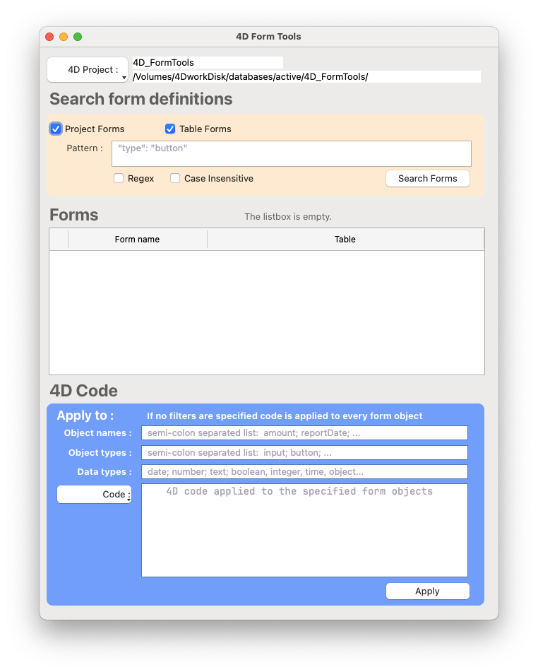

# 4D FormTools

A versatile 4D application designed to provide developer tools for making precise adjustments and changes to existing forms in 4D projects. This tool enables bulk modifications, pattern-based searches, and automated transformations across multiple forms. FormTools provides much of the functionality of Form Macros while allowing you to write 4D code on the fly to apply to specific forms and form objects.

## Features

### 🔍 **Form Search & Analysis**

- **GREP Integration**: Search through form definitions using powerful grep patterns
- **Pattern Matching**: Find forms containing specific object types, classes, or properties
- **Recursive Search**: Search through all project forms and table forms
- **File Listing**: Generate lists of matching form files for bulk operations

### ⚙️ **Bulk Form Modifications**

- **Mass Updates**: Apply transformations to multiple forms simultaneously
- **Object Filtering**: Target specific form objects by:
  - Object names
  - Object types (button, input, etc.)
  - Data types (date, integer, text, etc.)
- **Code Transformation**: Execute custom 4D code against form objects
- **Automatic Reload**: Project automatically reloads to reflect changes

### 🛠️ **Developer Interface**

- **Component, Standalone or Integrated**: 4D FormTools can be used as a component, standalone application, or integrated into existing projects. When used standalone you can select any 4D project to modify.


## Installation

### Standalone Usage
- Open the 4D FormTools project in 4D v20 or later.
- Run the `modify_forms` project form
- Click the `4D Project` button to select the 4D project you want to modify.

### Integrated Usage
- Copy the files in the `FormTools core` folder into your 4D project.

### As a component
- Make an alias of the `4D_FormTools,4DProject` file and place it in the Components folder of your 4D project. This allows you to use the FormTools methods directly in your project.

There is no benefit to compiling `FormTools` and I think it is actually more useful uncompiled. This is a developer tool and is not intended for end-users or production use. In most cases you will be using it to perform short, focused changes where the majority of time will be with disk access which compiling won't really affect.

## What you can do

The problem I needed to address that started this project was this: a client project had hundreds of forms with some formatting problems on most of them. Part of the issue was an early attempt to use CSS which got a little out of hand. I needed to remove some CSS from various form objects on various forms. To do that I wanted to search the actual form JSON files for objects using specific CSS classes. To make it more difficult only some objects with a particular class needed to be changed. Only `date` objects, for example.

4D's search tool won't find properties of a form object. VS Code will find them but I still had to manually go through each file to find the correct objects.

### The Edit Dialog


#### **Step 1** - Find the forms
Enter a pattern to search for. Take a look at the actual `form.4DForm` files to see what you are searching for. A lot of times you can just paste in an example. Use this approach when you want to find all forms that have some specific characteristic.

> Pro tip: you can drag and drop a selection of forms from the `4D Explorer` to the listbox.

#### **Step 2** - Choose the forms to apply changes to
The checkboxes on the left side of the listbox let you choose which forms you want to apply your changes to.

#### **Step 3** - Filter the objects on a form
When you apply code to a form FormTools loads the JSON form into an object then loops through each object. You can specify specific object names, object types and even data types to apply your code to. If you don't specify any filters the code is applied to each object.

#### **Step 4** - Write and apply some code
You can write a method, a `transform`, and it will be applied to each object. Your method receives the form object as `$1`. You _can_ use almost any 4D commands in this context but be reasonable and keep it simple.

For example:
```4d
    // make the class input_regular
    $1.class:="input_regular"
    $1.placeholder:=" type the correct value here"
```

Each transform you create will be kept and added to the `Code` menu.
> Pro tip: make the first line of each transform a descriptive comment

If you have more complex code you might want to just write a method (a big reason this works better uncompiled) and call that method:

```4d
    // myNewMethod
    myNewMethod($1)
```

It's just 4D code and you know how to write 4D code. The form object is just an object.

## Backup first!

This is a fantastic tool but it really is important to be smart when you use it. If you aren't using git or some other version control I don't really recommend using it. You can change too much too fast. Otherwise - the best practice is to make a new branch of the project before you start. If you make a mistake you just revert that file - or the whole session.

##


## Contributing

This tool is designed for 4D developers who need to make systematic changes across multiple forms. Contributions and improvements are welcome.

## License

This project is provided as-is for development purposes. Please ensure you have proper backups before using.

---

**Created by:** Kirk Brooks
**Last Updated:** June 2025
**4D Version:** v20+
